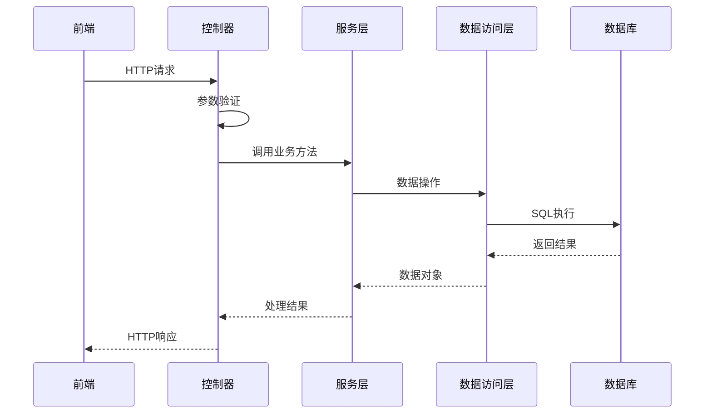
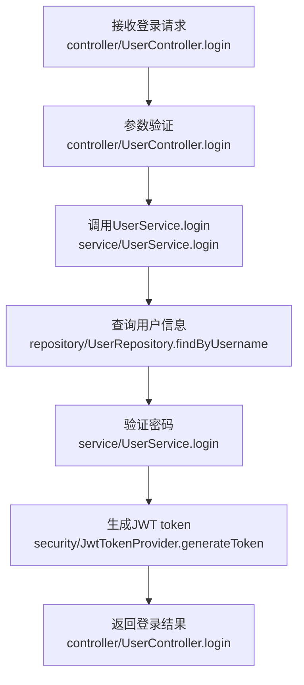
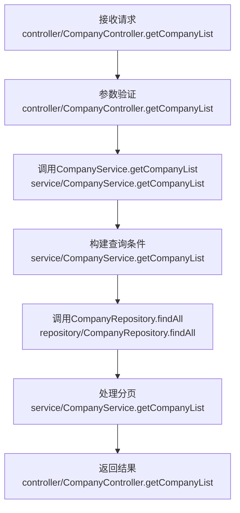
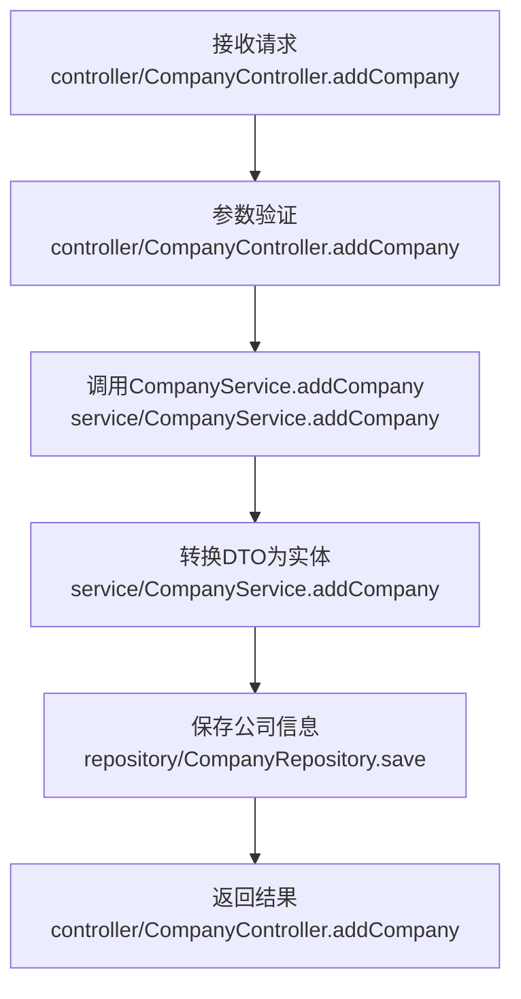
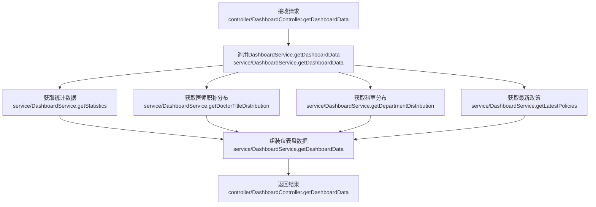

# 慧医数字医疗应用系统后端技术方案

## 1. 技术选型

| 分类 | 技术 | 版本 | 选型理由 |
| :--- | :--- | :--- | :--- |
| 基础框架 | Spring Boot | 3.2.0 | 快速构建、自动配置、内嵌容器，适合开发RESTful API |
| 安全框架 | Spring Security | 6.2.0 | 提供完整的认证和授权机制，保护API安全 |
| 持久层框架 | MyBatis-Plus | 3.5.5 | 简化MyBatis使用，提供CRUD操作，支持分页和条件查询 |
| 数据库 | MySQL | 8.0 | 关系型数据库，稳定可靠，适合存储结构化数据 |
| 缓存 | Redis | 7.0+ | 缓存热点数据，提高系统性能 |
| API文档 | SpringDoc OpenAPI | 2.0.2 | 自动生成API文档，方便前端开发 |
| 工具库 | Hutool | 5.8.25 | 提供常用工具类，简化开发 |
| 验证框架 | Spring Validation | 6.2.0 | 验证请求参数，确保数据有效性 |

## 2. 关键设计

### 2.1. 架构设计
- **架构风格**: 集成式单体应用 (Integrated Monolith)。后端逻辑作为独立模块，与前端通过API交互。
- **模块划分**:
  - `backend/src/main/java/com/huiyi/medical`
    - `controller`: 处理HTTP请求，返回响应
    - `service`: 业务逻辑层，实现核心功能
    - `repository`: 数据访问层，与数据库交互
    - `model`: 数据模型，对应数据库表
    - `dto`: 数据传输对象，用于前后端数据交换
    - `config`: 系统配置
    - `security`: 安全相关配置
    - `exception`: 异常处理
    - `util`: 工具类

- **核心流程图**:



### 2.2. 目录结构

```plaintext
backend/       # 后端应用
  ├── src/
  │   ├── main/
  │   │   ├── java/com/huiyi/medical/
  │   │   │   ├── controller/         # 控制器
  │   │   │   │   ├── UserController.java
  │   │   │   │   ├── CompanyController.java
  │   │   │   │   ├── PolicyController.java
  │   │   │   │   ├── MaterialController.java
  │   │   │   │   ├── CityController.java
  │   │   │   │   ├── LocationController.java
  │   │   │   │   ├── MedicineController.java
  │   │   │   │   ├── DoctorController.java
  │   │   │   │   └── DashboardController.java
  │   │   │   ├── service/            # 服务层
  │   │   │   │   ├── UserService.java
  │   │   │   │   ├── CompanyService.java
  │   │   │   │   ├── PolicyService.java
  │   │   │   │   ├── MaterialService.java
  │   │   │   │   ├── CityService.java
  │   │   │   │   ├── LocationService.java
  │   │   │   │   ├── MedicineService.java
  │   │   │   │   ├── DoctorService.java
  │   │   │   │   └── DashboardService.java
  │   │   │   ├── repository/         # 数据访问层
  │   │   │   │   ├── UserRepository.java
  │   │   │   │   ├── CompanyRepository.java
  │   │   │   │   ├── PolicyRepository.java
  │   │   │   │   ├── MaterialRepository.java
  │   │   │   │   ├── CityRepository.java
  │   │   │   │   ├── LocationRepository.java
  │   │   │   │   ├── MedicineRepository.java
  │   │   │   │   └── DoctorRepository.java
  │   │   │   ├── model/              # 数据模型
  │   │   │   │   ├── User.java
  │   │   │   │   ├── Company.java
  │   │   │   │   ├── Policy.java
  │   │   │   │   ├── Material.java
  │   │   │   │   ├── City.java
  │   │   │   │   ├── Location.java
  │   │   │   │   ├── Medicine.java
  │   │   │   │   └── Doctor.java
  │   │   │   ├── dto/                # 数据传输对象
  │   │   │   │   ├── UserDTO.java
  │   │   │   │   ├── CompanyDTO.java
  │   │   │   │   ├── PolicyDTO.java
  │   │   │   │   ├── MaterialDTO.java
  │   │   │   │   ├── CityDTO.java
  │   │   │   │   ├── LocationDTO.java
  │   │   │   │   ├── MedicineDTO.java
  │   │   │   │   ├── DoctorDTO.java
  │   │   │   │   └── DashboardDTO.java
  │   │   │   ├── config/             # 配置
  │   │   │   │   ├── SecurityConfig.java
  │   │   │   │   ├── MyBatisConfig.java
  │   │   │   │   └── WebConfig.java
  │   │   │   ├── security/           # 安全
  │   │   │   │   ├── JwtAuthenticationFilter.java
  │   │   │   │   ├── JwtTokenProvider.java
  │   │   │   │   └── CustomUserDetailsService.java
  │   │   │   ├── exception/          # 异常处理
  │   │   │   │   ├── GlobalExceptionHandler.java
  │   │   │   │   └── BusinessException.java
  │   │   │   └── util/               # 工具类
  │   │   │       ├── ResponseUtil.java
  │   │   │       └── PasswordUtil.java
  │   │   └── resources/
  │   │       ├── application.yml     # 应用配置
  │   │       └── mapper/             # MyBatis映射文件
  │   └── test/                       # 测试
  ├── pom.xml                         # Maven配置
```

### 2.3. 关键类与函数设计

| 类/函数名 | 说明 | 参数（类型/含义） | 成功返回结构/类型 | 失败返回结构/类型 | 所属文件/模块 | 溯源 |
|---------|------|-----------------|-----------------|-----------------|-------------|------|
| `UserController.login()` | 用户登录 | username: String 用户名<br>password: String 密码 | `{"code": 200, "data": {"token": "...", "user": {...}}, "message": "登录成功"}` | `{"code": 401, "message": "用户名或密码错误"}` | controller/UserController.java | <mcfile>src/views/Login.vue</mcfile> |
| `UserController.getUserList()` | 获取用户列表 | page: int 页码<br>size: int 每页数量<br>keyword: String 搜索关键词 | `{"code": 200, "data": {"list": [...], "total": 100}, "message": "获取成功"}` | `{"code": 500, "message": "获取失败"}` | controller/UserController.java | <mcfile>src/views/user/UserList.vue</mcfile> |
| `CompanyController.getCompanyList()` | 获取公司列表 | page: int 页码<br>size: int 每页数量<br>companyName: String 公司名称<br>city: String 城市 | `{"code": 200, "data": {"list": [...], "total": 100}, "message": "获取成功"}` | `{"code": 500, "message": "获取失败"}` | controller/CompanyController.java | <mcfile>src/views/company/CompanyList.vue</mcfile> |
| `CompanyController.addCompany()` | 添加公司 | companyDTO: CompanyDTO 公司信息 | `{"code": 200, "data": {"id": 1}, "message": "添加成功"}` | `{"code": 400, "message": "参数错误"}` | controller/CompanyController.java | <mcfile>src/views/company/AddCompany.vue</mcfile> |
| `PolicyController.getPolicyList()` | 获取政策列表 | page: int 页码<br>size: int 每页数量<br>policyName: String 政策名称<br>companyId: Long 公司ID | `{"code": 200, "data": {"list": [...], "total": 100}, "message": "获取成功"}` | `{"code": 500, "message": "获取失败"}` | controller/PolicyController.java | <mcfile>src/views/company/PolicyList.vue</mcfile> |
| `MaterialController.getMaterialList()` | 获取材料列表 | page: int 页码<br>size: int 每页数量<br>materialName: String 材料名称<br>type: String 材料类型 | `{"code": 200, "data": {"list": [...], "total": 100}, "message": "获取成功"}` | `{"code": 500, "message": "获取失败"}` | controller/MaterialController.java | <mcfile>src/views/material/MaterialList.vue</mcfile> |
| `CityController.getCityList()` | 获取城市列表 | page: int 页码<br>size: int 每页数量<br>cityName: String 城市名称 | `{"code": 200, "data": {"list": [...], "total": 100}, "message": "获取成功"}` | `{"code": 500, "message": "获取失败"}` | controller/CityController.java | <mcfile>src/views/city/CityList.vue</mcfile> |
| `LocationController.getLocationList()` | 获取地点列表 | page: int 页码<br>size: int 每页数量<br>locationName: String 地点名称<br>city: String 城市 | `{"code": 200, "data": {"list": [...], "total": 100}, "message": "获取成功"}` | `{"code": 500, "message": "获取失败"}` | controller/LocationController.java | <mcfile>src/views/location/LocationList.vue</mcfile> |
| `MedicineController.getMedicineList()` | 获取药品列表 | page: int 页码<br>size: int 每页数量<br>medicineName: String 药品名称<br>type: String 药品类型 | `{"code": 200, "data": {"list": [...], "total": 100}, "message": "获取成功"}` | `{"code": 500, "message": "获取失败"}` | controller/MedicineController.java | <mcfile>src/views/medicine/MedicineList.vue</mcfile> |
| `DoctorController.getDoctorList()` | 获取医师列表 | page: int 页码<br>size: int 每页数量<br>doctorName: String 医师姓名<br>department: String 科室 | `{"code": 200, "data": {"list": [...], "total": 100}, "message": "获取成功"}` | `{"code": 500, "message": "获取失败"}` | controller/DoctorController.java | <mcfile>src/views/doctor/DoctorList.vue</mcfile> |
| `DashboardController.getDashboardData()` | 获取仪表盘数据 | 无 | `{"code": 200, "data": {...}, "message": "获取成功"}` | `{"code": 500, "message": "获取失败"}` | controller/DashboardController.java | <mcfile>src/views/dashboard/Dashboard.vue</mcfile> |

### 2.4. 数据库与数据结构设计

#### 2.4.1. 数据库表结构

**`user`表**
| 字段名 | 数据类型 | 约束 | 描述 |
| :--- | :--- | :--- | :--- |
| `id` | `BIGINT` | `PRIMARY KEY, AUTO_INCREMENT` | 用户ID |
| `username` | `VARCHAR(50)` | `UNIQUE, NOT NULL` | 用户名 |
| `password` | `VARCHAR(100)` | `NOT NULL` | 密码（加密） |
| `name` | `VARCHAR(50)` | `NOT NULL` | 姓名 |
| `role` | `VARCHAR(20)` | `NOT NULL` | 角色 |
| `created_at` | `DATETIME` | `DEFAULT CURRENT_TIMESTAMP` | 创建时间 |
| `updated_at` | `DATETIME` | `DEFAULT CURRENT_TIMESTAMP ON UPDATE CURRENT_TIMESTAMP` | 更新时间 |

**`company`表**
| 字段名 | 数据类型 | 约束 | 描述 |
| :--- | :--- | :--- | :--- |
| `id` | `BIGINT` | `PRIMARY KEY, AUTO_INCREMENT` | 公司ID |
| `company_name` | `VARCHAR(100)` | `NOT NULL` | 公司名称 |
| `contact` | `VARCHAR(50)` | `NOT NULL` | 联系人 |
| `phone` | `VARCHAR(20)` | `NOT NULL` | 联系电话 |
| `city` | `VARCHAR(50)` | `NOT NULL` | 城市 |
| `address` | `VARCHAR(200)` | `NOT NULL` | 地址 |
| `created_at` | `DATETIME` | `DEFAULT CURRENT_TIMESTAMP` | 创建时间 |
| `updated_at` | `DATETIME` | `DEFAULT CURRENT_TIMESTAMP ON UPDATE CURRENT_TIMESTAMP` | 更新时间 |

**`policy`表**
| 字段名 | 数据类型 | 约束 | 描述 |
| :--- | :--- | :--- | :--- |
| `id` | `BIGINT` | `PRIMARY KEY, AUTO_INCREMENT` | 政策ID |
| `policy_name` | `VARCHAR(100)` | `NOT NULL` | 政策名称 |
| `company_id` | `BIGINT` | `NOT NULL, FOREIGN KEY` | 公司ID |
| `effective_date` | `DATE` | `NOT NULL` | 生效日期 |
| `expiry_date` | `DATE` | `NOT NULL` | 过期日期 |
| `created_at` | `DATETIME` | `DEFAULT CURRENT_TIMESTAMP` | 创建时间 |
| `updated_at` | `DATETIME` | `DEFAULT CURRENT_TIMESTAMP ON UPDATE CURRENT_TIMESTAMP` | 更新时间 |

**`material`表**
| 字段名 | 数据类型 | 约束 | 描述 |
| :--- | :--- | :--- | :--- |
| `id` | `BIGINT` | `PRIMARY KEY, AUTO_INCREMENT` | 材料ID |
| `material_name` | `VARCHAR(100)` | `NOT NULL` | 材料名称 |
| `type` | `VARCHAR(50)` | `NOT NULL` | 材料类型 |
| `description` | `VARCHAR(500)` | `NOT NULL` | 描述 |
| `created_at` | `DATETIME` | `DEFAULT CURRENT_TIMESTAMP` | 创建时间 |
| `updated_at` | `DATETIME` | `DEFAULT CURRENT_TIMESTAMP ON UPDATE CURRENT_TIMESTAMP` | 更新时间 |

**`city`表**
| 字段名 | 数据类型 | 约束 | 描述 |
| :--- | :--- | :--- | :--- |
| `id` | `BIGINT` | `PRIMARY KEY, AUTO_INCREMENT` | 城市ID |
| `city_name` | `VARCHAR(50)` | `NOT NULL` | 城市名称 |
| `province` | `VARCHAR(50)` | `NOT NULL` | 所属省份 |
| `code` | `VARCHAR(20)` | `NOT NULL` | 城市代码 |
| `created_at` | `DATETIME` | `DEFAULT CURRENT_TIMESTAMP` | 创建时间 |
| `updated_at` | `DATETIME` | `DEFAULT CURRENT_TIMESTAMP ON UPDATE CURRENT_TIMESTAMP` | 更新时间 |

**`location`表**
| 字段名 | 数据类型 | 约束 | 描述 |
| :--- | :--- | :--- | :--- |
| `id` | `BIGINT` | `PRIMARY KEY, AUTO_INCREMENT` | 地点ID |
| `location_name` | `VARCHAR(100)` | `NOT NULL` | 地点名称 |
| `city` | `VARCHAR(50)` | `NOT NULL` | 城市 |
| `address` | `VARCHAR(200)` | `NOT NULL` | 地址 |
| `contact` | `VARCHAR(50)` | `NOT NULL` | 联系人 |
| `phone` | `VARCHAR(20)` | `NOT NULL` | 联系电话 |
| `created_at` | `DATETIME` | `DEFAULT CURRENT_TIMESTAMP` | 创建时间 |
| `updated_at` | `DATETIME` | `DEFAULT CURRENT_TIMESTAMP ON UPDATE CURRENT_TIMESTAMP` | 更新时间 |

**`medicine`表**
| 字段名 | 数据类型 | 约束 | 描述 |
| :--- | :--- | :--- | :--- |
| `id` | `BIGINT` | `PRIMARY KEY, AUTO_INCREMENT` | 药品ID |
| `medicine_name` | `VARCHAR(100)` | `NOT NULL` | 药品名称 |
| `type` | `VARCHAR(50)` | `NOT NULL` | 药品类型 |
| `specification` | `VARCHAR(100)` | `NOT NULL` | 规格 |
| `price` | `DECIMAL(10,2)` | `NOT NULL` | 价格 |
| `manufacturer` | `VARCHAR(100)` | `NOT NULL` | 生产厂家 |
| `created_at` | `DATETIME` | `DEFAULT CURRENT_TIMESTAMP` | 创建时间 |
| `updated_at` | `DATETIME` | `DEFAULT CURRENT_TIMESTAMP ON UPDATE CURRENT_TIMESTAMP` | 更新时间 |

**`doctor`表**
| 字段名 | 数据类型 | 约束 | 描述 |
| :--- | :--- | :--- | :--- |
| `id` | `BIGINT` | `PRIMARY KEY, AUTO_INCREMENT` | 医师ID |
| `doctor_name` | `VARCHAR(50)` | `NOT NULL` | 医师姓名 |
| `department` | `VARCHAR(50)` | `NOT NULL` | 科室 |
| `title` | `VARCHAR(50)` | `NOT NULL` | 职称 |
| `phone` | `VARCHAR(20)` | `NOT NULL` | 联系电话 |
| `email` | `VARCHAR(100)` | `NOT NULL` | 邮箱 |
| `created_at` | `DATETIME` | `DEFAULT CURRENT_TIMESTAMP` | 创建时间 |
| `updated_at` | `DATETIME` | `DEFAULT CURRENT_TIMESTAMP ON UPDATE CURRENT_TIMESTAMP` | 更新时间 |

#### 2.4.2. 数据传输对象 (DTOs)

```java
// dto/UserDTO.java
public class UserDTO {
    private Long id;
    private String username;
    private String password;
    private String name;
    private String role;
    // getters and setters
}

// dto/CompanyDTO.java
public class CompanyDTO {
    private Long id;
    private String companyName;
    private String contact;
    private String phone;
    private String city;
    private String address;
    // getters and setters
}

// dto/PolicyDTO.java
public class PolicyDTO {
    private Long id;
    private String policyName;
    private Long companyId;
    private String companyName;
    private LocalDate effectiveDate;
    private LocalDate expiryDate;
    // getters and setters
}

// dto/MaterialDTO.java
public class MaterialDTO {
    private Long id;
    private String materialName;
    private String type;
    private String description;
    // getters and setters
}

// dto/CityDTO.java
public class CityDTO {
    private Long id;
    private String cityName;
    private String province;
    private String code;
    // getters and setters
}

// dto/LocationDTO.java
public class LocationDTO {
    private Long id;
    private String locationName;
    private String city;
    private String address;
    private String contact;
    private String phone;
    // getters and setters
}

// dto/MedicineDTO.java
public class MedicineDTO {
    private Long id;
    private String medicineName;
    private String type;
    private String specification;
    private BigDecimal price;
    private String manufacturer;
    // getters and setters
}

// dto/DoctorDTO.java
public class DoctorDTO {
    private Long id;
    private String doctorName;
    private String department;
    private String title;
    private String phone;
    private String email;
    // getters and setters
}

// dto/DashboardDTO.java
public class DashboardDTO {
    private int doctorCount;
    private int medicineCount;
    private int companyCount;
    private int locationCount;
    private List<DoctorTitleDistribution> doctorTitleDistribution;
    private List<DepartmentDistribution> departmentDistribution;
    private List<LatestPolicy> latestPolicies;
    // getters and setters
}

// dto/DoctorTitleDistribution.java
public class DoctorTitleDistribution {
    private String title;
    private int count;
    // getters and setters
}

// dto/DepartmentDistribution.java
public class DepartmentDistribution {
    private String department;
    private int count;
    // getters and setters
}

// dto/LatestPolicy.java
public class LatestPolicy {
    private String title;
    private String type;
    private String effectiveDate;
    private String status;
    // getters and setters
}
```

#### 2.4.3. 配置项

| 配置项 | 类型 | 默认值 | 说明 | 所属文件/模块 | 类型 | 溯源 |
| ----- | --- | ----- | ---- | ------------ | ---- | ---- |
| `server.port` | int | 8080 | 服务器端口 | application.yml | 新增 | <mcfile>src/router/index.js</mcfile> |
| `spring.datasource.url` | String | jdbc:mysql://localhost:3306/medical | 数据库连接URL | application.yml | 新增 | <mcfile>src/views/company/CompanyList.vue</mcfile> |
| `spring.datasource.username` | String | root | 数据库用户名 | application.yml | 新增 | <mcfile>src/views/company/CompanyList.vue</mcfile> |
| `spring.datasource.password` | String | password | 数据库密码 | application.yml | 新增 | <mcfile>src/views/company/CompanyList.vue</mcfile> |
| `spring.jpa.hibernate.ddl-auto` | String | update | Hibernate DDL策略 | application.yml | 新增 | <mcfile>src/views/company/CompanyList.vue</mcfile> |
| `jwt.secret` | String | your-secret-key | JWT密钥 | application.yml | 新增 | <mcfile>src/views/Login.vue</mcfile> |
| `jwt.expiration` | long | 86400000 | JWT过期时间（毫秒） | application.yml | 新增 | <mcfile>src/views/Login.vue</mcfile> |

### 2.4. API 接口设计

| API路径 | 方法 | 模块/文件 | 类型 | 功能描述 | 请求体 (JSON) | 成功响应 (200 OK) |
| :--- | :--- | :--- | :--- | :--- | :--- | :--- |
| `/api/auth/login` | `POST` | `controller/UserController` | `Router` | 用户登录 | `{"username": "admin", "password": "123456"}` | `{"code": 200, "data": {"token": "...", "user": {...}}, "message": "登录成功"}` |
| `/api/users` | `GET` | `controller/UserController` | `Router` | 获取用户列表 | N/A | `{"code": 200, "data": {"list": [...], "total": 100}, "message": "获取成功"}` |
| `/api/users` | `POST` | `controller/UserController` | `Router` | 添加用户 | `{"username": "user1", "password": "123456", "name": "用户1", "role": "user"}` | `{"code": 200, "data": {"id": 1}, "message": "添加成功"}` |
| `/api/users/{id}` | `PUT` | `controller/UserController` | `Router` | 修改用户 | `{"username": "user1", "name": "用户1", "role": "user"}` | `{"code": 200, "message": "修改成功"}` |
| `/api/users/{id}` | `DELETE` | `controller/UserController` | `Router` | 删除用户 | N/A | `{"code": 200, "message": "删除成功"}` |
| `/api/companies` | `GET` | `controller/CompanyController` | `Router` | 获取公司列表 | N/A | `{"code": 200, "data": {"list": [...], "total": 100}, "message": "获取成功"}` |
| `/api/companies` | `POST` | `controller/CompanyController` | `Router` | 添加公司 | `{"companyName": "北京医药有限公司", "contact": "张三", "phone": "13800138000", "city": "北京", "address": "北京市朝阳区某某大厦"}` | `{"code": 200, "data": {"id": 1}, "message": "添加成功"}` |
| `/api/companies/{id}` | `PUT` | `controller/CompanyController` | `Router` | 修改公司 | `{"companyName": "北京医药有限公司", "contact": "张三", "phone": "13800138000", "city": "北京", "address": "北京市朝阳区某某大厦"}` | `{"code": 200, "message": "修改成功"}` |
| `/api/companies/{id}` | `DELETE` | `controller/CompanyController` | `Router` | 删除公司 | N/A | `{"code": 200, "message": "删除成功"}` |
| `/api/policies` | `GET` | `controller/PolicyController` | `Router` | 获取政策列表 | N/A | `{"code": 200, "data": {"list": [...], "total": 100}, "message": "获取成功"}` |
| `/api/policies` | `POST` | `controller/PolicyController` | `Router` | 添加政策 | `{"policyName": "药品折扣政策", "companyId": 1, "effectiveDate": "2024-01-01", "expiryDate": "2024-12-31"}` | `{"code": 200, "data": {"id": 1}, "message": "添加成功"}` |
| `/api/policies/{id}` | `PUT` | `controller/PolicyController` | `Router` | 修改政策 | `{"policyName": "药品折扣政策", "companyId": 1, "effectiveDate": "2024-01-01", "expiryDate": "2024-12-31"}` | `{"code": 200, "message": "修改成功"}` |
| `/api/policies/{id}` | `DELETE` | `controller/PolicyController` | `Router` | 删除政策 | N/A | `{"code": 200, "message": "删除成功"}` |
| `/api/materials` | `GET` | `controller/MaterialController` | `Router` | 获取材料列表 | N/A | `{"code": 200, "data": {"list": [...], "total": 100}, "message": "获取成功"}` |
| `/api/materials` | `POST` | `controller/MaterialController` | `Router` | 添加材料 | `{"materialName": "营业执照", "type": "business_license", "description": "企业合法经营的证明"}` | `{"code": 200, "data": {"id": 1}, "message": "添加成功"}` |
| `/api/materials/{id}` | `PUT` | `controller/MaterialController` | `Router` | 修改材料 | `{"materialName": "营业执照", "type": "business_license", "description": "企业合法经营的证明"}` | `{"code": 200, "message": "修改成功"}` |
| `/api/materials/{id}` | `DELETE` | `controller/MaterialController` | `Router` | 删除材料 | N/A | `{"code": 200, "message": "删除成功"}` |
| `/api/cities` | `GET` | `controller/CityController` | `Router` | 获取城市列表 | N/A | `{"code": 200, "data": {"list": [...], "total": 100}, "message": "获取成功"}` |
| `/api/cities` | `POST` | `controller/CityController` | `Router` | 添加城市 | `{"cityName": "北京", "province": "北京", "code": "110000"}` | `{"code": 200, "data": {"id": 1}, "message": "添加成功"}` |
| `/api/cities/{id}` | `PUT` | `controller/CityController` | `Router` | 修改城市 | `{"cityName": "北京", "province": "北京", "code": "110000"}` | `{"code": 200, "message": "修改成功"}` |
| `/api/cities/{id}` | `DELETE` | `controller/CityController` | `Router` | 删除城市 | N/A | `{"code": 200, "message": "删除成功"}` |
| `/api/locations` | `GET` | `controller/LocationController` | `Router` | 获取地点列表 | N/A | `{"code": 200, "data": {"list": [...], "total": 100}, "message": "获取成功"}` |
| `/api/locations` | `POST` | `controller/LocationController` | `Router` | 添加地点 | `{"locationName": "北京朝阳区药店", "city": "北京", "address": "北京市朝阳区某某街道", "contact": "张三", "phone": "13800138000"}` | `{"code": 200, "data": {"id": 1}, "message": "添加成功"}` |
| `/api/locations/{id}` | `PUT` | `controller/LocationController` | `Router` | 修改地点 | `{"locationName": "北京朝阳区药店", "city": "北京", "address": "北京市朝阳区某某街道", "contact": "张三", "phone": "13800138000"}` | `{"code": 200, "message": "修改成功"}` |
| `/api/locations/{id}` | `DELETE` | `controller/LocationController` | `Router` | 删除地点 | N/A | `{"code": 200, "message": "删除成功"}` |
| `/api/medicines` | `GET` | `controller/MedicineController` | `Router` | 获取药品列表 | N/A | `{"code": 200, "data": {"list": [...], "total": 100}, "message": "获取成功"}` |
| `/api/medicines` | `POST` | `controller/MedicineController` | `Router` | 添加药品 | `{"medicineName": "阿莫西林胶囊", "type": "prescription", "specification": "0.25g*24粒", "price": 12.5, "manufacturer": "华北制药"}` | `{"code": 200, "data": {"id": 1}, "message": "添加成功"}` |
| `/api/medicines/{id}` | `PUT` | `controller/MedicineController` | `Router` | 修改药品 | `{"medicineName": "阿莫西林胶囊", "type": "prescription", "specification": "0.25g*24粒", "price": 12.5, "manufacturer": "华北制药"}` | `{"code": 200, "message": "修改成功"}` |
| `/api/medicines/{id}` | `DELETE` | `controller/MedicineController` | `Router` | 删除药品 | N/A | `{"code": 200, "message": "删除成功"}` |
| `/api/doctors` | `GET` | `controller/DoctorController` | `Router` | 获取医师列表 | N/A | `{"code": 200, "data": {"list": [...], "total": 100}, "message": "获取成功"}` |
| `/api/doctors` | `POST` | `controller/DoctorController` | `Router` | 添加医师 | `{"doctorName": "张医生", "department": "内科", "title": "主任医师", "phone": "13800138001", "email": "zhang@example.com"}` | `{"code": 200, "data": {"id": 1}, "message": "添加成功"}` |
| `/api/doctors/{id}` | `PUT` | `controller/DoctorController` | `Router` | 修改医师 | `{"doctorName": "张医生", "department": "内科", "title": "主任医师", "phone": "13800138001", "email": "zhang@example.com"}` | `{"code": 200, "message": "修改成功"}` |
| `/api/doctors/{id}` | `DELETE` | `controller/DoctorController` | `Router` | 删除医师 | N/A | `{"code": 200, "message": "删除成功"}` |
| `/api/dashboard` | `GET` | `controller/DashboardController` | `Router` | 获取仪表盘数据 | N/A | `{"code": 200, "data": {...}, "message": "获取成功"}` |

### 2.5. 主业务流程与调用链

#### 2.5.1. 用户登录流程



调用链：
- `controller/UserController.login()` → `service/UserService.login()` → `repository/UserRepository.findByUsername()` → `security/JwtTokenProvider.generateToken()`

#### 2.5.2. 获取公司列表流程



调用链：
- `controller/CompanyController.getCompanyList()` → `service/CompanyService.getCompanyList()` → `repository/CompanyRepository.findAll()`

#### 2.5.3. 添加公司流程



调用链：
- `controller/CompanyController.addCompany()` → `service/CompanyService.addCompany()` → `repository/CompanyRepository.save()`

#### 2.5.4. 获取仪表盘数据流程



调用链：
- `controller/DashboardController.getDashboardData()` → `service/DashboardService.getDashboardData()` → 多个repository方法调用

## 3. 部署与集成方案

### 3.1. 依赖与环境

| 依赖 | 版本/范围 | 用途 | 安装命令 | 所属文件/配置 |
| :--- | :--- | :--- | :--- | :--- |
| `spring-boot-starter-web` | `3.2.0` | Web应用基础依赖 | `npm install` | pom.xml |
| `spring-boot-starter-security` | `6.2.0` | 安全框架 | `npm install` | pom.xml |
| `mybatis-plus-boot-starter` | `3.5.5` | MyBatis增强工具 | `npm install` | pom.xml |
| `mysql-connector-java` | `8.0.33` | MySQL驱动 | `npm install` | pom.xml |
| `spring-boot-starter-data-redis` | `3.2.0` | Redis缓存 | `npm install` | pom.xml |
| `springdoc-openapi-starter-webmvc-ui` | `2.0.2` | API文档 | `npm install` | pom.xml |
| `hutool-all` | `5.8.25` | 工具库 | `npm install` | pom.xml |
| `spring-boot-starter-validation` | `6.2.0` | 参数验证 | `npm install` | pom.xml |
| `jjwt` | `0.11.5` | JWT工具 | `npm install` | pom.xml |

### 3.3. 集成与启动方案

- **配置文件 (`application.yml`)**:

```yaml
server:
  port: 8080

spring:
  datasource:
    url: jdbc:mysql://localhost:3306/medical?useSSL=false&serverTimezone=UTC
    username: root
    password: password
    driver-class-name: com.mysql.cj.jdbc.Driver
  redis:
    host: localhost
    port: 6379
    password: 

mybatis-plus:
  mapper-locations: classpath:mapper/*.xml
  type-aliases-package: com.huiyi.medical.model

jwt:
  secret: your-secret-key
  expiration: 86400000

logging:
  level:
    com.huiyi.medical: info
```

- **启动脚本 (`start.sh`)**:

```bash
#!/bin/bash
java -jar medical-backend.jar --spring.profiles.active=prod
```

- **编译与打包**:

```bash
# 编译
mvn clean compile

# 打包
mvn clean package -DskipTests

# 运行
java -jar target/medical-backend.jar
```

### 4. 代码安全性

#### 4.1. 注意事项

1. **SQL注入**：使用MyBatis-Plus的参数化查询，避免直接拼接SQL语句。
2. **密码安全**：使用BCrypt等算法对密码进行加密存储，避免明文存储密码。
3. **JWT令牌泄露**：设置合理的令牌过期时间，使用HTTPS传输，避免在前端存储敏感信息。
4. **跨站脚本攻击(XSS)**：对输入输出进行过滤，使用Content-Security-Policy头部。
5. **跨站请求伪造(CSRF)**：使用CSRF令牌，验证请求来源。
6. **权限控制**：实现基于角色的权限控制，确保用户只能访问授权的资源。
7. **敏感信息泄露**：避免在响应中包含敏感信息，使用日志脱敏。
8. **API速率限制**：实现API速率限制，防止暴力攻击。

#### 4.2. 解决方案

1. **SQL注入防护**：
   - 使用MyBatis-Plus的Wrapper查询，避免直接拼接SQL
   - 对用户输入进行验证和过滤

2. **密码安全**：
   - 使用Spring Security的BCryptPasswordEncoder对密码进行加密
   - 实现密码强度检查

3. **JWT令牌安全**：
   - 设置合理的过期时间
   - 使用HTTPS传输
   - 实现令牌刷新机制

4. **XSS防护**：
   - 对输入输出进行HTML转义
   - 使用Content-Security-Policy头部
   - 实现输入验证

5. **CSRF防护**：
   - 使用Spring Security的CSRF保护
   - 对敏感操作使用POST请求

6. **权限控制**：
   - 实现基于角色的权限控制
   - 使用Spring Security的注解进行方法级权限控制

7. **敏感信息保护**：
   - 实现日志脱敏
   - 避免在响应中包含敏感信息
   - 使用环境变量存储敏感配置

8. **API速率限制**：
   - 使用Redis实现API速率限制
   - 对敏感操作进行更严格的限制

## 5. 总结

本技术方案基于Spring Boot框架设计了一个完整的后端系统，支持前端的所有功能需求。系统采用分层架构，包括控制器、服务层、数据访问层等，实现了用户管理、医药公司管理、必备材料管理、城市信息管理、销售地点管理、药品信息管理、医师管理和仪表盘等功能。

系统使用MySQL作为数据库，MyBatis-Plus作为持久层框架，Spring Security提供安全保障，JWT实现无状态认证。通过合理的数据库设计和API设计，确保系统的可扩展性和可维护性。

同时，本方案考虑了系统的安全性，包括SQL注入防护、密码安全、JWT令牌安全、XSS防护、CSRF防护、权限控制、敏感信息保护和API速率限制等方面，确保系统的安全性和稳定性。

本方案可以作为后端开发的指导文档，帮助开发人员快速理解系统架构和实现细节，从而高效地完成后端开发任务。